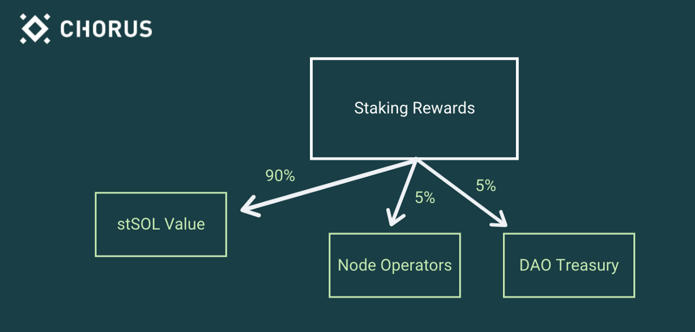

# Staking Overview


## Solana Liquid Staking
Solana is an extremely fast, and censorship-resistant blockchain that has witnessed tremendous growth and adoption in the last year. Solana serves transactions at an order of magnitude higher rate when compared to base layer Ethereum. Additionally, there is a flourishing ecosystem emerging around [Serum](https://solana.com/ecosystem/serum) and other DeFi protocols such as [Raydium](https://solana.com/ecosystem/raydium), [Oxygen](https://solana.com/ecosystem/oxygen), [Pyth Network](https://www.theblockcrypto.com/linked/100875/jump-trading-defi-oracle-solana), and others that are being built on Solana. With over [$14bn staked](https://www.stakingrewards.com/earn/solana), Solana is now also in the Top 5 of Proof-of-Stake networks by staked value.
Liquid staking takes the utility of Solana a step further by:
- Improving the user experience
- Diversifying risks across multiple node and operators
- Providing instant liquidity — that can also be leveraged to earn secondary rewards (beyond the primary staking rewards) through
- Integrations with DeFi protocols that support Solana’s liquid representation token

## Comparison with traditional staking on Solana

With traditional staking in Solana, the user has to perform a number of steps:

- Create a Stake Account and transfer SOL to it
- Set its deposit and withdraw authorities
- Delegate it to a validator
- Wait for activation of the delegation before the stake starts earning rewards

Furthermore, in traditional staking, if the user wants to diversify her stake across validators she would have to create and manage stake accounts for each validator.

Staking SOL through Lido will come with a variety of benefits:
- One-step process — Just deposit into the pool with a single click
- The pool takes care of validator diversification
- Immediate appreciation — You start earning from the pool from the moment of deposit. This gets reflected in the value-appreciation of **stSOL** tokens

Interestingly, there is no waiting time for receiving **stSOL** tokens. When a user delegates their SOL tokens they do not need to perform or wait for the completion of any delegation or activation steps, as is the norm in traditional staking. The user can instantly exchange **stSOL** for SOL at any time in the open market.

In Lido for ETH, withdrawals from the Lido program are blocked until the ETH2 chain is live. In Lido for Solana, staggered withdrawals will be enabled. These direct withdrawals will take a couple of epochs to process, and will be beneficial for large withdrawals (e.g. because there will be no slippage from trading on the open market). However, for small withdrawals exchanging **stSOL** on a DEX (e.g. to SOL) will likely prove to be the go-to solution in order to exit a staking position with Lido for most of the users.


## Rewards
Reward distribution in 'Lido for Solana' is an interesting deviation from how rewards are distributed in Lido for Ethereum, which pegs ```ETH2 to stETH in a 1:1 ratio.```

To understand how rewards work for 'Lido for Solana' let's look at a hypothetical scenario. Let's assume that the pool contains ```2000 SOL``` and while we are at it let us also assume that a total of ```1800 stSOL``` are held by the token holders. This puts an exchange rate of ```0.9 stSOL per SOL.```

$$
\frac{1800}{2000}=0.9\textnormal{ stSOL }\textbf{per}\textnormal{ SOL}
$$


If Alice deposits ```1 SOL``` now she will get ```0.9 stSOL``` in return. As rewards accrue SOL balance goes up, let’s say from ```2000``` to ```2100```. The new exchange rate becomes


$$
\frac{1800}{2000}=0.86\textnormal{ stSOL }\textbf{per}\textnormal{ SOL}
$$

Now if Alice goes and enquires about the value of her ```0.9 stSOL```, she finds it to be

$$
0.9*\frac{1800}{2000}=1.05\textnormal{ SOL}
$$

Effectively, her SOL balance potentially went up by 5% from ```1 SOL``` to ```1.05 SOL```. This approach is called the **share-pool approach.** Even though the numbers here are hypothetical they represent the concept of rewards accurately.

> **Note**
The accrued rewards here are after a fee cut for Lido maintainers. To incentivize sustainable management of the Lido ecosystem, a portion of the rewards is split between the node operators and DAO treasury. The remaining larger chunk (on Ethereum, these amount to 90%) of rewards accrue to Lido users and get reflected in the increased value of stSOL as explained above.



Lido for Solana doesn’t follow the pegging approach, followed by ETH and stETH, as of now. However, this might be considered for revision when Solana launches native support for rebasing in SPL tokens.
Utilizing Liquidity
The stSOLs that one gets can be used to reap secondary rewards through DeFi protocols. There will also be liquidity pools on AMM protocols and other DEXes where one will be able to immediately exchange stSOL for SOL. For the **ETH<->stETH** pair a popular AMM in terms of liquidity and volume is the Curve pool.
