# How to Stake Solana on Lido
A quick guide on staking your Solana on the Lido widget

## Introduction
‘Lido for Solana’ is a Lido-DAO governed liquid staking protocol for the Solana blockchain. Anyone who stakes their SOL tokens with Lido will be issued an on-chain representation of SOL staking position with Lido validators, called stSOL. This will allow Solana token holders to get liquidity on their staked assets which can then be traded, or further utilized as collateral in DeFi products.

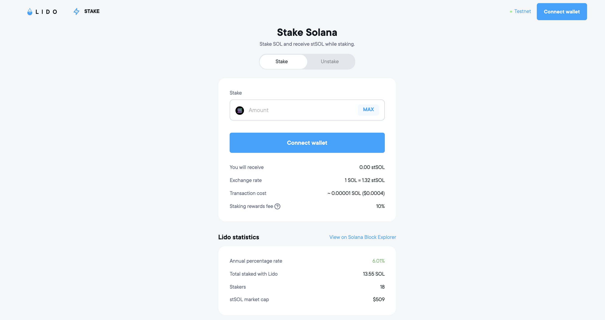

## Lido for Solana staking guide

In this step-by-step guide, we will learn how to stake your Solana via the Lido staking widget. This guide shows the testnet for demonstration purposes. However, the process remains the same for mainnet. You can use one of the following wallets to connect to Lido. The facility to use the hardware wallet Ledger is also provided. This guarantees an extra layer of security for the user.
1. Sollet
2. Phantom
3. Solflare
4. Solong
5. Ledger

---

## Step 1: Create or Restore Solflare Wallet
Navigate to https://solflare.com/ to create/restore your solana wallet.

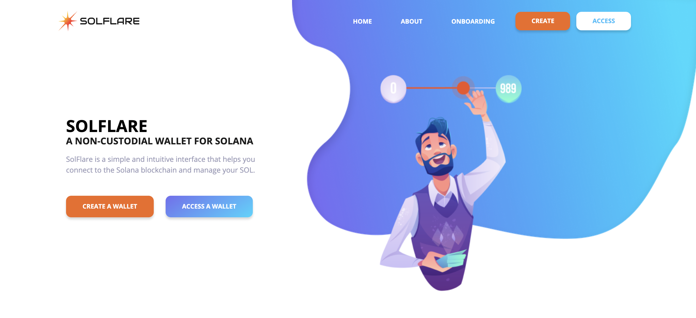

### Creating the wallet
If you do not have a wallet you yet, you should
1. Create a new wallet,
2. Note down your password, and
3. Download the kyestore file, and
store these in a safe place. Follow the onscreen instructions and make sure to fund your wallet with some SOL tokens before interacting with Lido

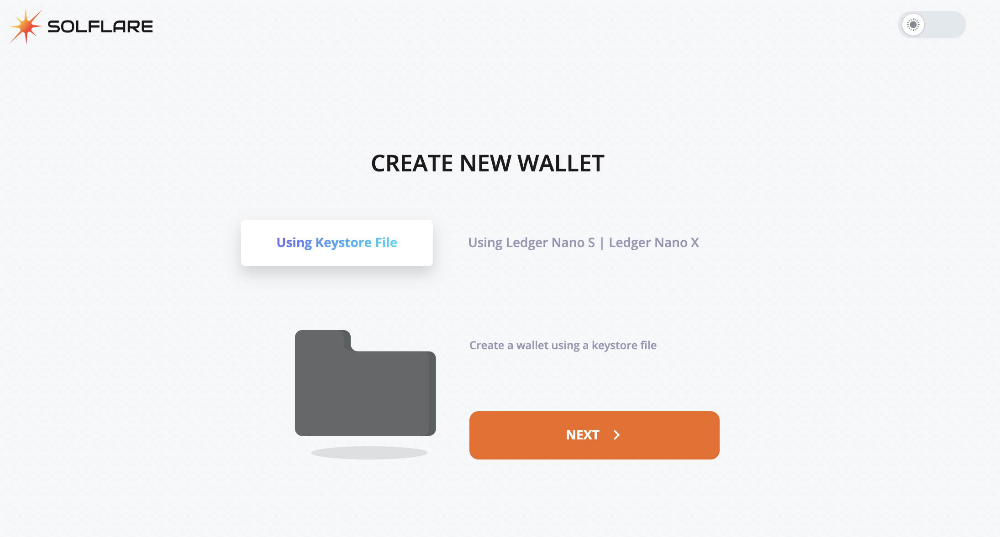
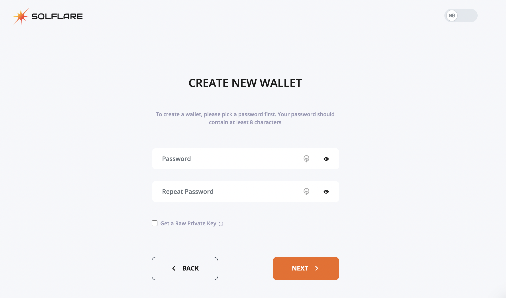

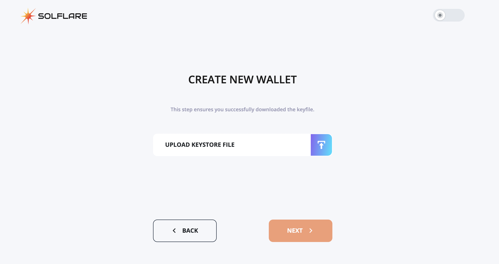
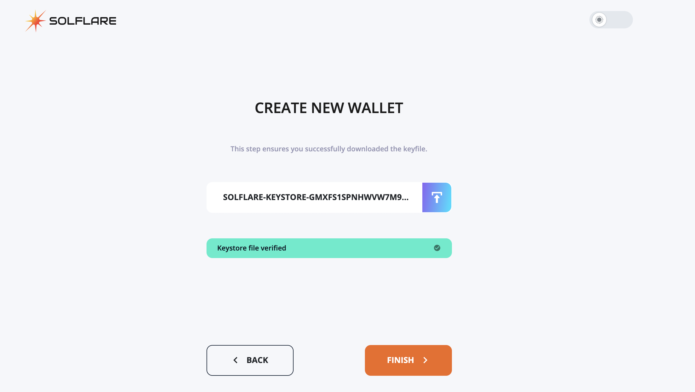

### Restoring the wallet
If you already have a wallet, you can restore it on solflare using the associated password and keystore file. Follow the online instructions to restore your SOL account.

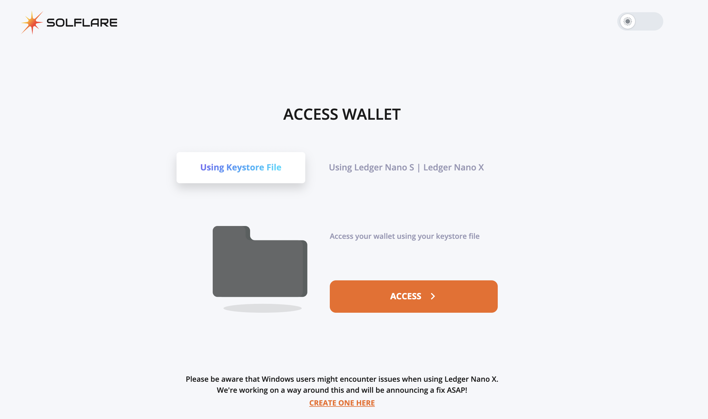
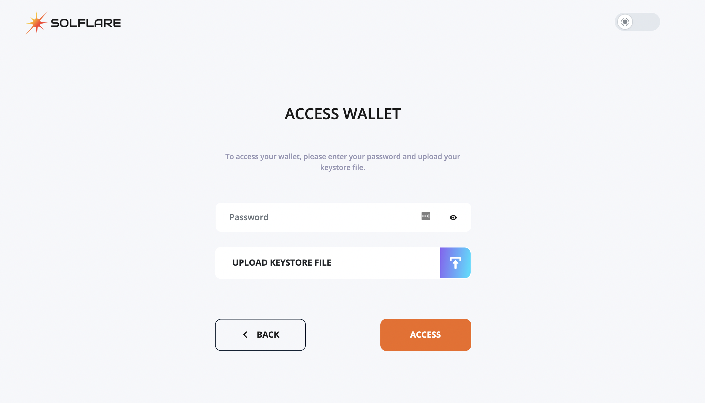

### Logged In
Once you have funded your Solflare wallet with Solana, you can log in to solflare webapp to see your account details.

## Step 2: Connect Lido to Solflare

Once your wallet is setup visit https://solana.lido.fi to stake your SOL tokens. Now connect your Solflare account to the Lido interface.

Pressing the connect wallet button, on the top right hand corner of the screen, pops up the wallet screen.

Selecting your wallet and pressing the connect button takes you to another window with the wallet’s browser extension. On this window you will have to **approve the connection**. Make sure to verify the details listed on the approval screen by Solflare.

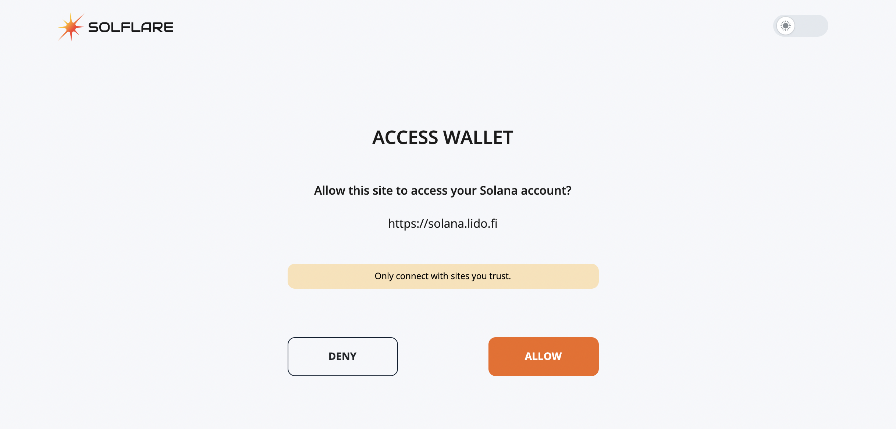

If you have set a password to open the wallet, you might get prompted to unlock your wallet. You will, then, have to allow Lido to connect to your wallet and fetch its balance. Once connected you would be able to see your balance on the Lido widget.

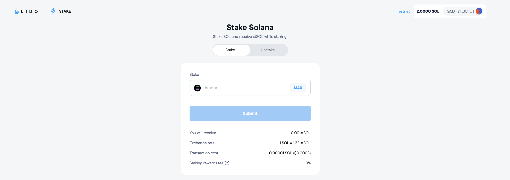

Before you interact with the widget further it is important to explore the widget and understand its functionality.

## Step 3: Explore the interface
At the top you can see your account’s information — your current stSOL balance and the number of SOL tokens available for staking. For new account holders, the staked amount (stSOL) will be 0 in the beginning. You can also see the returns you will get by staking with Lido under Lido APR. Below that you can enter the number of SOL you want to stake.

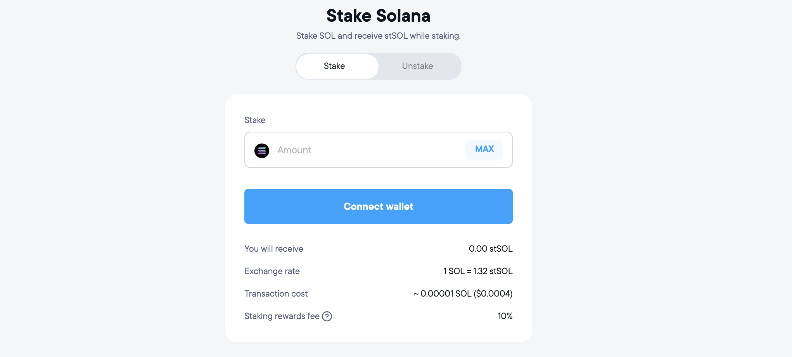

### Account info
You can go to the top-right corner of the screen and click on your connected account. This lets you take a look at your address and disconnect at any point during the process.
The address for the demo account is
> `GMXFs1SpNhwVW7m9sHTZks5oEEtAVqmySX2zkJ5ffUT`

Its transaction history can be viewed on the blockexplorer [here](.https://explorer.solana.com/address/GMXFs1SpNhwVW7m9sHTZks5oEEtAVqmySX2zkJ5ffUT?cluster=testnet).

### Transaction Parameters
When you enter the amount of SOL you want to stake, the values below the submit button change automatically. These values give you specific information about the transaction you are about to perform. It tells you the
- Exchange rate of SOL v/s stSOL at the moment
- Amount of stSOL you will receive
- Transaction cost
- Fee that will be deducted for this transaction

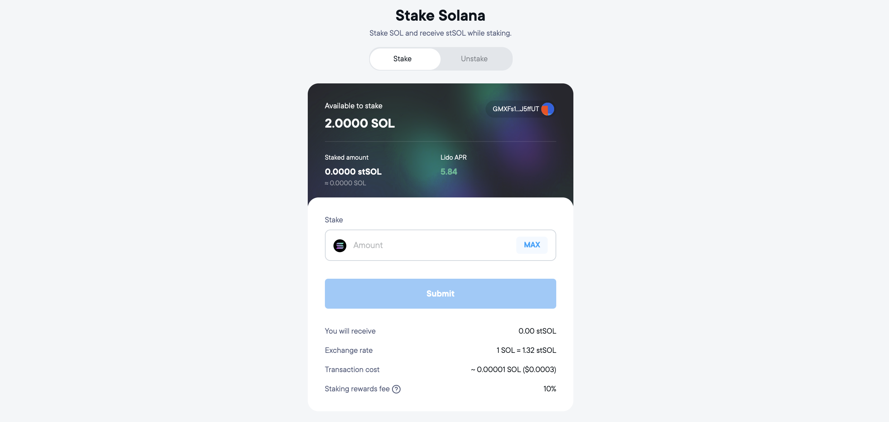

### Lido Statistics
Just below the transaction parameters you also see global Lido statistics. This gives you a clear idea of how much SOL is being staked worldwide and other information regarding the liquid staking ecosystem.

### FAQs
You can see the FAQ section right below the Lido statistics. It is prudent to familiarize yourself with some of the basic features of liquid staking and the risks involved. The FAQ section also gives more information about the stSOL and its value. In case, you have even more questions you can always reach out to the Lido team or Chorus One for any clarifications. The contact information is given at the end of this article.

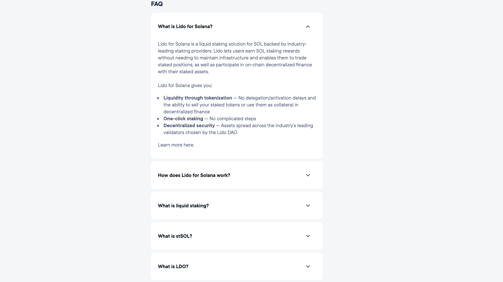

## Step 4: Stake your SOL

To stake your SOL with lido enter the amount you wanter to stake. Once you submit you might get redirected to your wallet. On the lido widget will see a pop-up showing the state of your transaction. The Lido widget waits for you to approve this transaction through your wallet.

>Note **This transaction will only go through if you go back to your wallet and approve it.**

You get additional information about the transaction details while approving the transaction. Go ahead and approve the transaction.

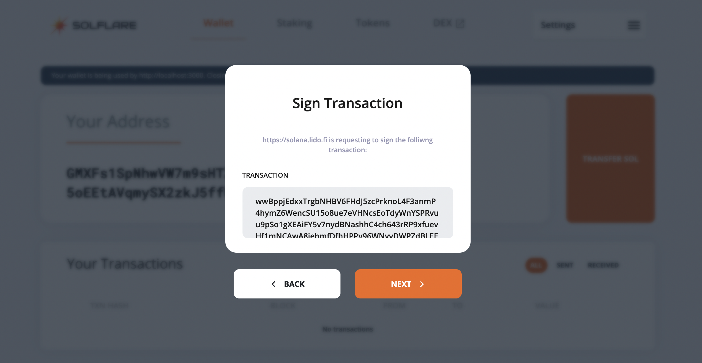

After verifying the information you can approve now.

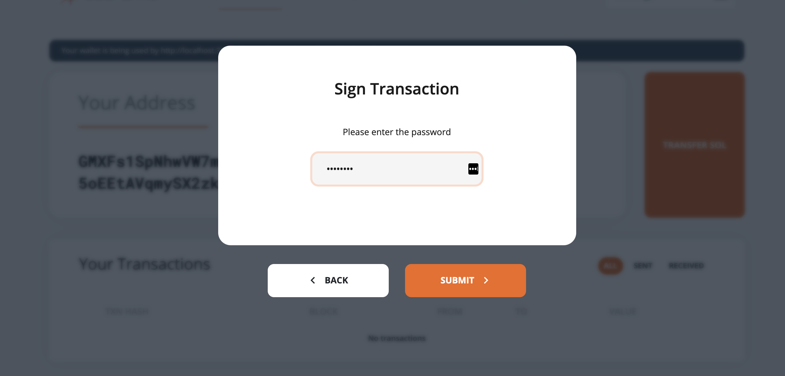

## Step 5: View the transaction on Blockexplorer

Once you hit approve on your wallet, you can come back to the lido widget and click on **View on Solana Blockexplorer.**

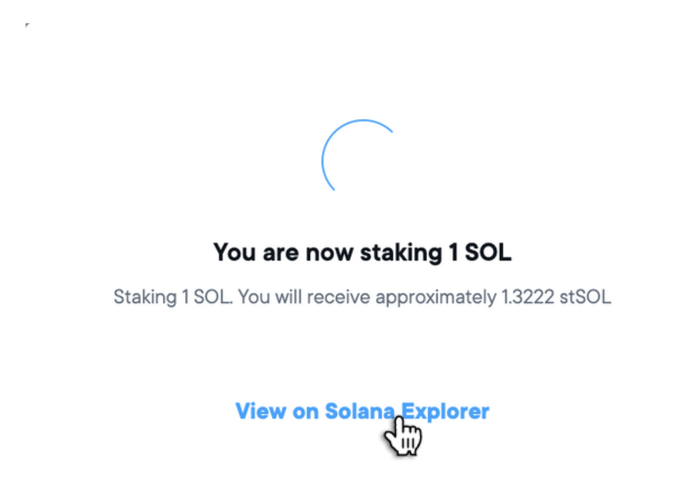

This is useful as it tells you the [current status](.https://explorer.solana.com/tx/3sLpWNJrhY7nUWKuLJx6nTGjxaJNUGTYVsFT8Uh9UNa5nQ2rRMZZcnb66ELEMSME5cmUycP4V4CUoBSvhAjLiwdw?cluster=testnet) of your transaction.

> Link for the above transaction - https://explorer.solana.com/tx/3sLpWNJrhY7nUWKuLJx6nTGjxaJNUGTYVsFT8Uh9UNa5nQ2rRMZZcnb66ELEMSME5cmUycP4V4CUoBSvhAjLiwdw?cluster=testnet

If you look at the Confirmations field you can slowly see it increasing from 0 to 32. Once it reaches the MAX number of confirmations your transaction gets added to the blockchain

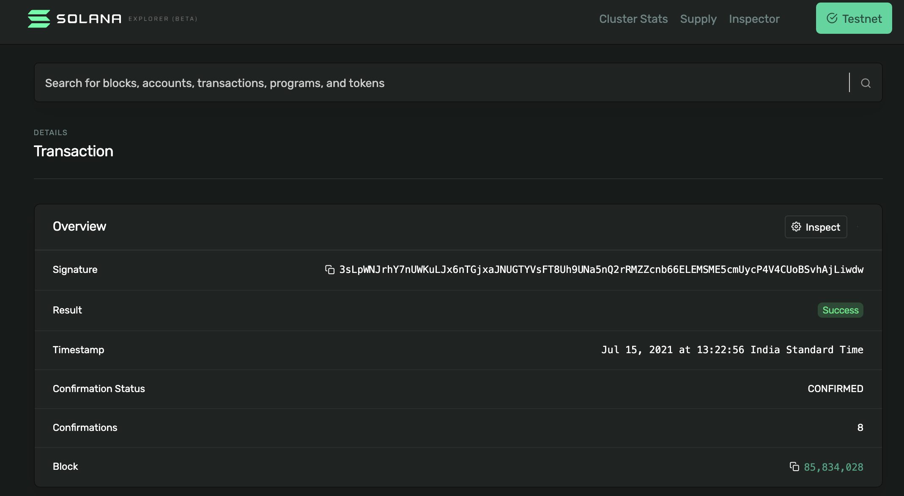
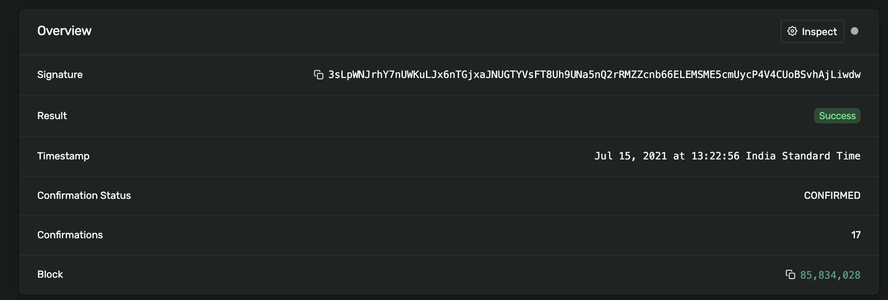

Finally, after 32 confirmations the transaction gets confirmed. The lido widget will reflect the new balance

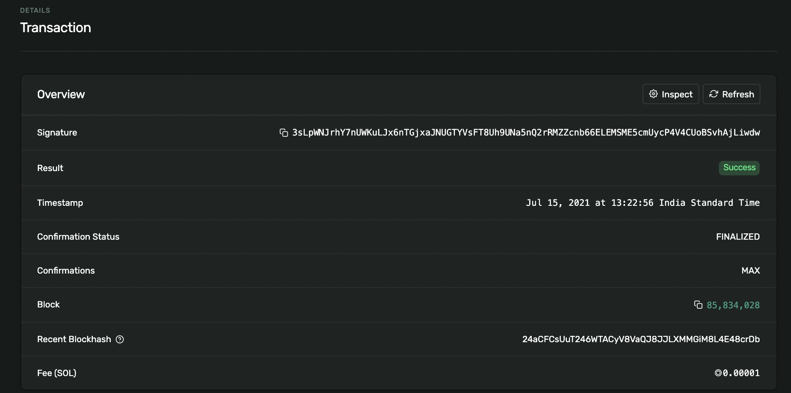

You can now go back to the Lido widget and look at your updated stSOL balance. Just below the stSOL balance, you will also be able to see the amount of SOL you can get back for it a.k.a the exchange rate.

> Note 1: We had 2 SOL in the beginning and we staked 1 SOL. We should be left with 1 SOL but we had to pay an additional 0.0021 SOL as the rent for the new stSOL account that got created for us.

> Note 2: This rent is a one-time fee that won’t reccur on the next staking transaction.

## Withdrawing Solana
Withdrawals are not enabled yet. They will be live within the coming months. If you click on the **Unstake** tab you will see an error message pop up.

## Resources
[Introducing Lido for Solana](.https://medium.com/chorus-one/introducing-lido-for-solana-8aa02db8503) - Explaining the SOL liquid staking solution by Chorus One

