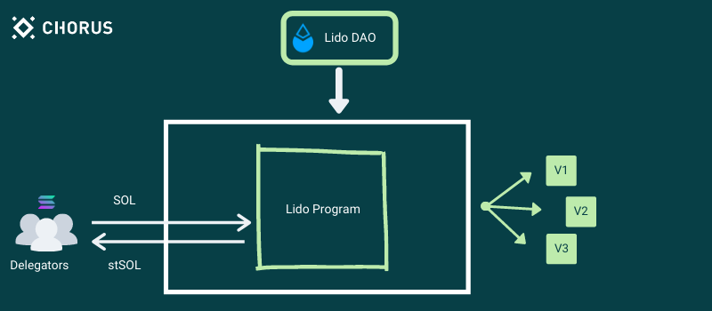

# Overview

## Lido for Solana

'Lido for Solana' is a Lido-DAO governed liquid staking protocol for the Solana blockchain. Anyone who stakes their SOL tokens with Lido will be issued an on-chain representation of SOL staking position with Lido validators, called **stSOL**. We will work to integrate stSOL widely into the Solana DeFi ecosystem to enable stSOL users to make use of their staked assets in a variety of applications.

Lido for Solana gives you:
- **Liquidity** — No delegation/activation delays and the ability to sell your staked tokens
- **One-click staking** — No complicated steps
- **Decentralized security** — Assets spread across the industry’s leading validators chosen by the Lido DAO

## How Lido for Solana works

Lido for Solana not only makes it very easy to stake but also provides further utility through stSOL. Let’s look at the process in slight detail. A SOL token holder connects their wallet to the Lido interface (hosted at https://solana.lido.fi) and deposits their tokens into the Lido program. They immediately receive stSOL tokens that represent a share of the total pool. Every user’s tokens are first held in a pool controlled by the Lido program.

The Lido program collects the deposited SOL and releases the newly minted stSOL to the user. Beneath the layer, the Lido Program will  distribute this SOL uniformly across those validators that are participating. When these delegations accrue rewards on the allotted stake, the total SOL under management increases and this increases the value of stSOL tokens. The Lido DAO governs the Lido Program — and also controls the list of validators that are part of this program.

